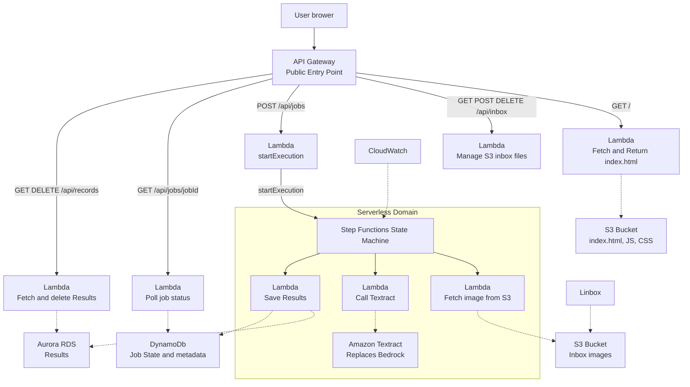
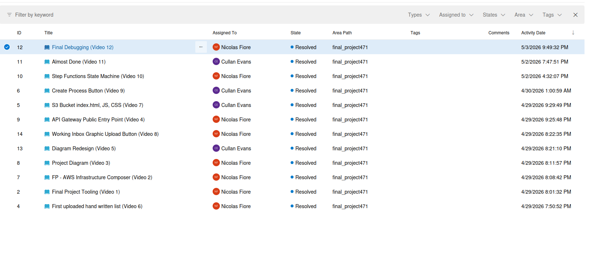
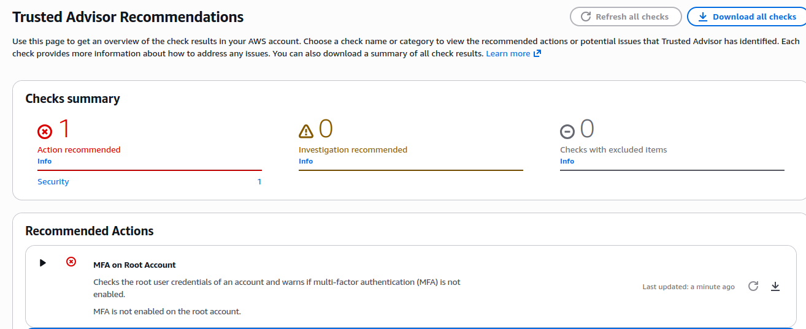
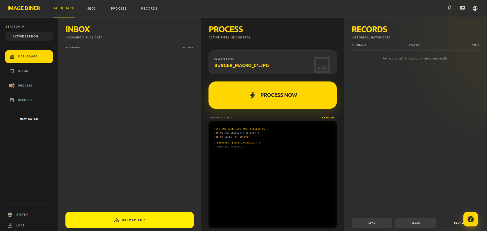

By: 
* Nicolas Fiore
* Cullan Evans

# Project Overview

A serverless AWS application that extracts text from images using Amazon Textract, tracks job status, and stores results. Users upload images through a web interface, and the system automatically processes them through a pipeline of Lambda functions.

# System Overview
The application is a serverless image processing platform that uses API Gateway as the public entry point. A static website is served from S3 via a Lambda function, while API requests are routed through dedicated Lambda handlers for inbox management, job submission, polling, and result retrieval.

Incoming files are stored in an S3 inbox bucket. A submit Lambda starts a Step Functions workflow, which coordinates three worker Lambdas: L1 fetches the image from S3, L2 calls Amazon Textract for OCR, and L3 saves the results into Aurora and DynamoDB. CloudWatch provides observability for the Step Functions workflow.

## Diagram

# DevOps 



# Gherkin Feature Files

## Image Processing - Nicolas Fiore
```gherkin
Feature: Image processing pipeline
  Background:
    Given an S3 bucket with an image file
    And a DynamoDB job table

  Scenario: Successfully process an image through the pipeline
    Given a job_id, filename, and bucket in the event
    When L1Fetch is invoked
    Then it returns a job_id and filename
    And L2Call receives the output
    When L2Call invokes Textract
    Then it returns extracted items
    And L3Save receives the items
    When L3Save stores results
    Then the job status is updated to COMPLETED
```

## Job Polling and Records - Cullan Evans
```gherkin
Feature: Poll job status and manage processed records
  Background:
    Given an image processing application
    And a DynamoDB jobs table
    And an API Gateway connected to Lambda functions

  Scenario: Successfully poll a job status
    Given a jobID exists in the request path
    When L_POLL is invoked through GET /api/jobs/{jobID}
    Then it reads the job from the DynamoDB jobs table
    And it returns the jobID, status, and message
    And it includes CORS headers in the response

  Scenario: Successfully load processed records
    Given processed records exist for completed image jobs
    When the records page calls GET /api/records
    Then the records are returned as JSON
    And index.html displays the records in the records table

  Scenario: Successfully delete a processed record
    Given a processed record exists in the records table
    When the user clicks the delete button for that record
    Then DELETE /api/records/{id} is called
    And the records table reloads without the deleted record

  Scenario: Replace Aurora with DynamoDB storage
    Given the learner lab does not allow Aurora DB cluster creation
    When the database dependency is updated
    Then the application uses DynamoDB as the storage solution
```

# Well Architected Questions
1. Operational Excellence
    Fiore: Monitor with CloudWatch and keep deployment repeatable with SAM.  
    Evans: Use DevOps user stories, linked GitHub commits, and Gherkin feature files to track work clearly from planning to implementation.
    
2. Security
    Fiore: Use least-privilege IAM and encrypt data at rest.  
    Evans: Restrict API Gateway routes, protect S3 buckets from public access, and require MFA on AWS root account
    
4. Reliability
    Fiore: Add retries, backups, and alarms for failures.  
    Evans: Use DynamoDB job status tracking so failed image processing steps can be identified and rerun.
   
6. Performance
    Fiore: Use serverless scaling and keep functions small.  
    Evans: Split the workflow into separate Lambda functions so tasks like fetching images and saving results run independently.
    
8. Cost Optimization
    Fiore: Use pay-per-request services and remove unused resources.  
    Evans: Use S3, Lambda, and DynamoDB only when processing jobs are needed. This keeps the monthly cost lower.

# Security, Access, and Recovery
- Apply least-privilege IAM so each Lambda only accesses the S3 bucket, DynamoDB table, or Step Functions execution it needs.
- Encrypt data at rest for S3 and DynamoDB using AWS-managed or customer-managed KMS keys.
- Restrict API Gateway to only allowed routes and methods, and avoid exposing any extra public endpoints.
- Limit Step Functions access so only the submit Lambda and trusted roles can start executions.
- For recovery, enable S3 versioning, use DynamoDB point-in-time recovery, and keep database snapshots for results storage.
- Monitor issues with CloudWatch alarms and use retries or dead-letter queues for Lambda and workflow failures.

# Trusted Advisor


# TCO 
* 

# Template.yaml
```yaml
Transform: AWS::Serverless-2016-10-31

# Template input parameters
Parameters:
  LabRoleArn:
    Type: String
    Description: The ARN of the LabRole AWS Learner Lab
    Default: arn:aws:iam::949571450787:role/LabRole
Resources:
  # API Gateway and health endpoint
  Api:
    Type: AWS::Serverless::Api
    Properties:
      Name: !Sub
        - ${ResourceName} From Stack ${AWS::StackName}
        - ResourceName: Api
      StageName: Prod
      EndpointConfiguration: REGIONAL
      TracingEnabled: true
  HealthFunction:
    Type: AWS::Serverless::Function
    Properties:
      Description: !Sub
        - Stack ${AWS::StackName} Function ${ResourceName}
        - ResourceName: Healthunction
      CodeUri: health_service
      Handler: handler.handler
      Role: !Ref LabRoleArn
      Runtime: python3.13
      MemorySize: 3008
      Timeout: 30
      Tracing: Active
      Environment: {}
      Events:
        ApiGET:
          Type: Api
          Properties:
            Path: /api/health
            Method: GET
            RestApiId: !Ref Api
  HeealthFunctionLogGroup:
    Type: AWS::Logs::LogGroup
    DeletionPolicy: Delete
    UpdateReplacePolicy: Delete
    Properties:
      LogGroupName: !Sub /aws/lambda/${HealthFunction}
      RetentionInDays: 7

  # Static website hosting bucket and security policy
  Bucket:
    Type: AWS::S3::Bucket
    Properties:
      BucketName: !Sub ${AWS::StackName}-bucket-${AWS::AccountId}
      BucketEncryption:
        ServerSideEncryptionConfiguration:
          - ServerSideEncryptionByDefault:
              SSEAlgorithm: aws:kms
              KMSMasterKeyID: alias/aws/s3
      PublicAccessBlockConfiguration:
        IgnorePublicAcls: true
        RestrictPublicBuckets: true
  BucketBucketPolicy:
    Type: AWS::S3::BucketPolicy
    Properties:
      Bucket: !Ref Bucket
      PolicyDocument:
        Id: RequireEncryptionInTransit
        Version: '2012-10-17'
        Statement:
          - Principal: '*'
            Action: '*'
            Effect: Deny
            Resource:
              - !GetAtt Bucket.Arn
              - !Sub ${Bucket.Arn}/*
            Condition:
              Bool:
                aws:SecureTransport: 'false'
  StaticProxyFunction:
    Type: AWS::Serverless::Function
    Properties:
      Description: !Sub
        - Stack ${AWS::StackName} Function ${ResourceName}
        - ResourceName: StaticProxyFunction
      CodeUri: src/proxy
      Handler: proxy.proxy_handler
      Runtime: python3.13
      Role: !Ref LabRoleArn
      MemorySize: 3008
      Timeout: 30
      Tracing: Active
      Environment:
        Variables:
          BUCKET_BUCKET_NAME: !Ref Bucket
          BUCKET_BUCKET_ARN: !GetAtt Bucket.Arn
      Events:
        ApiGET:
          Type: Api
          Properties:
            Path: /
            Method: GET
            RestApiId: !Ref Api
  StaticProxyFunctionLogGroup:
    Type: AWS::Logs::LogGroup
    DeletionPolicy: Delete
    UpdateReplacePolicy: Delete
    Properties:
      LogGroupName: !Sub /aws/lambda/${StaticProxyFunction}
      RetentionInDays: 7

  # Inbox S3 bucket for uploaded images and its access policy
  InboxBucket:
    Type: AWS::S3::Bucket
    Properties:
      BucketName: !Sub ${AWS::StackName}-inboxbuck-${AWS::AccountId}
      CorsConfiguration:
        CorsRules:
          - AllowedHeaders:
              - '*'
            AllowedMethods:
              - GET
              - PUT
              - POST
              - DELETE
            AllowedOrigins:
              - '*'
            ExposedHeaders:
              - ETag
            MaxAge: 300
      BucketEncryption:
        ServerSideEncryptionConfiguration:
          - ServerSideEncryptionByDefault:
              SSEAlgorithm: aws:kms
              KMSMasterKeyID: alias/aws/s3
      PublicAccessBlockConfiguration:
        IgnorePublicAcls: true
        RestrictPublicBuckets: true
  InboxBucketBucketPolicy:
    Type: AWS::S3::BucketPolicy
    Properties:
      Bucket: !Ref InboxBucket
      PolicyDocument:
        Id: RequireEncryptionInTransit
        Version: '2012-10-17'
        Statement:
          - Principal: '*'
            Action: '*'
            Effect: Deny
            Resource:
              - !GetAtt InboxBucket.Arn
              - !Sub ${InboxBucket.Arn}/*
            Condition:
              Bool:
                aws:SecureTransport: 'false'

  # Inbox API Lambda for managing uploaded image files
  LInbox:
    Type: AWS::Serverless::Function
    Properties:
      Description: !Sub
        - Stack ${AWS::StackName} Function ${ResourceName}
        - ResourceName: LInbox
      CodeUri: src/inbox
      Handler: handler.handler
      Runtime: python3.13
      Role: !Ref LabRoleArn
      MemorySize: 3008
      Timeout: 30
      Tracing: Active
      Environment:
        Variables:
          INBOX_BUCKET_NAME: !Ref InboxBucket
      Events:
        ApiGETInbox:
          Type: Api
          Properties:
            Path: /api/inbox
            Method: GET
            RestApiId: !Ref Api
        ApiPOSTInbox:
          Type: Api
          Properties:
            Path: /api/inbox
            Method: POST
            RestApiId: !Ref Api
        ApiDELETEInbox:
          Type: Api
          Properties:
            Path: /api/inbox/{key}
            Method: DELETE
            RestApiId: !Ref Api
  LInboxLogGroup:
    Type: AWS::Logs::LogGroup
    DeletionPolicy: Delete
    UpdateReplacePolicy: Delete
    Properties:
      LogGroupName: !Sub /aws/lambda/${LInbox}
      RetentionInDays: 7
  lsubmit:
    Type: AWS::Serverless::Function
    Properties:
      Description: !Sub
        - Stack ${AWS::StackName} Function ${ResourceName}
        - ResourceName: Lsubmit
      CodeUri: src/lsubmit
      Handler: handler.handler
      Runtime: python3.13
      Role: !Ref LabRoleArn
      MemorySize: 3008
      Timeout: 30
      Tracing: Active
      Environment:
        Variables:
          JOB_TABLE: !Ref JobsTable
          STATE_MACHINE_ARN: !Ref StateMachine
      Events:
        SubmitApi:
          Type: Api
          Properties:
            Path: /api/jobs
            Method: POST
            RestApiId: !Ref Api
  lsubmitLogGroup:
    Type: AWS::Logs::LogGroup
    DeletionPolicy: Delete
    UpdateReplacePolicy: Delete
    Properties:
      LogGroupName: !Sub /aws/lambda/${lsubmit}
      RetentionInDays: 7

  # Job state table for workflow tracking
  JobsTable:
    Type: AWS::DynamoDB::Table
    Properties:
      AttributeDefinitions:
        - AttributeName: jobid
          AttributeType: S
      BillingMode: PAY_PER_REQUEST
      KeySchema:
        - AttributeName: jobid
          KeyType: HASH
  # State machine worker Lambdas
  L1Fetch:
    Type: AWS::Serverless::Function
    Properties:
      Description: !Sub
        - Stack ${AWS::StackName} Function ${ResourceName}
        - ResourceName: L1Fetch
      CodeUri: src/statemachine
      Handler: l1fetch.handler
      Runtime: python3.13
      Role: !Ref LabRoleArn
      MemorySize: 3008
      Timeout: 30
      Tracing: Active
      Environment: {}
  L1FetchLogGroup:
    Type: AWS::Logs::LogGroup
    DeletionPolicy: Delete
    UpdateReplacePolicy: Delete
    Properties:
      LogGroupName: !Sub /aws/lambda/${L1Fetch}
      RetentionInDays: 7
  L2Call:
    Type: AWS::Serverless::Function
    Properties:
      Description: !Sub
        - Stack ${AWS::StackName} Function ${ResourceName}
        - ResourceName: L2Call
      CodeUri: src/statemachine
      Handler: l2call.handler
      Runtime: python3.13
      Role: !Ref LabRoleArn
      MemorySize: 3008
      Timeout: 30
      Tracing: Active
      Environment: {}
  L2CallLogGroup:
    Type: AWS::Logs::LogGroup
    DeletionPolicy: Delete
    UpdateReplacePolicy: Delete
    Properties:
      LogGroupName: !Sub /aws/lambda/${L2Call}
      RetentionInDays: 7
  L3Save:
    Type: AWS::Serverless::Function
    Properties:
      Description: !Sub
        - Stack ${AWS::StackName} Function ${ResourceName}
        - ResourceName: L3Save
      CodeUri: src/statemachine
      Handler: l3save.handler
      Runtime: python3.13
      Role: !Ref LabRoleArn
      MemorySize: 3008
      Timeout: 30
      Tracing: Active
      Environment:
        Variables:
          RECORDS_TABLE: !Ref RecordsTable
  L3SaveLogGroup:
    Type: AWS::Logs::LogGroup
    DeletionPolicy: Delete
    UpdateReplacePolicy: Delete
    Properties:
      LogGroupName: !Sub /aws/lambda/${L3Save}
      RetentionInDays: 7

  # Step Functions state machine orchestrating the processing pipeline
  StateMachine:
    Type: AWS::Serverless::StateMachine
    Properties:
      Role: !Ref LabRoleArn
      Definition:
        Comment: Shopping list image porcessing pipline
        StartAt: FetchImage
        States:
          FetchImage:
            Type: Task
            Resource: arn:aws:states:::lambda:invoke
            Parameters:
              FunctionName: ${L1FetchArn}
              payload.$: $
            ResultSelector:
              job_id.$: $.Payload.job_id
              filename.$: $.Payload.filename
              bucket.$: $.Payload.bucket
            Next: CallTextract
          CallTextract:
            Type: Task
            Resource: arn:aws:states:::lambda:invoke
            Parameters:
              FunctionName: ${L2CallArn}
              payload.$: $
            ResultSelector:
              job_id.$: $.Payload.job_id
              items.$: $.Payload.items
            Next: SaveResults
          SaveResults:
            Type: Task
            Resource: arn:aws:states:::lambda:invoke
            Parameters:
              FunctionName: ${L3SaveArn}
              payload.$: $
            ResultSelector:
              job_id.$: $.Payload.job_id
              rowCount.$: $.Payload.rowCount
            End: true
      Logging:
        Level: ALL
        IncludeExecutionData: true
        Destinations:
          - CloudWatchLogsLogGroup:
              LogGroupArn: !GetAtt StateMachineLogGroup.Arn
      Tracing:
        Enabled: true
      Type: STANDARD
      DefinitionSubstitutions:
        L1FetchArn: !GetAtt L1Fetch.Arn
        L2CallArn: !GetAtt L2Call.Arn
        L3SaveArn: !GetAtt L3Save.Arn
  StateMachineLogGroup:
    Type: AWS::Logs::LogGroup
    Properties:
      LogGroupName: !Sub
        - /aws/vendedlogs/states/${AWS::StackName}-${ResourceId}-Logs
        - ResourceId: StateMachine

  # Polling API for checking job status
  LPoll:
    Type: AWS::Serverless::Function
    Properties:
      Description: !Sub
        - Stack ${AWS::StackName} Function ${ResourceName}
        - ResourceName: LPoll
      CodeUri: src/lpoll
      Handler: lpoll.handler
      Runtime: python3.13
      Role: !Ref LabRoleArn
      MemorySize: 3008
      Timeout: 30
      Tracing: Active
      Environment:
        Variables:
          JOB_TABLE: !Ref JobsTable

      Events:
        ApiGETPoll:
          Type: Api
          Properties:
            Path: /api/jobs/{jobId}
            Method: GET
            RestApiId: !Ref Api
  LPollLogGroup:
    Type: AWS::Logs::LogGroup
    DeletionPolicy: Delete
    UpdateReplacePolicy: Delete
    Properties:
      LogGroupName: !Sub /aws/lambda/${LPoll}
      RetentionInDays: 7

  # Records API and result storage
  LRecords:
    Type: AWS::Serverless::Function
    Properties:
      Description: !Sub
        - Stack ${AWS::StackName} Function ${ResourceName}
        - ResourceName: LRecords
      CodeUri: src/lrecords
      Handler: lrecords.handler
      Runtime: python3.13
      Role: !Ref LabRoleArn
      MemorySize: 3008
      Timeout: 30
      Tracing: Active
      Environment:
        Variables:
          RECORDS_TABLE: !Ref RecordsTable
      Events:
        ApiGETRecords:
          Type: Api
          Properties:
            Path: /api/records
            Method: GET
            RestApiId: !Ref Api
        ApiDELETERecords:
          Type: Api
          Properties:
            Path: /api/records/id
            Method: DELETE
            RestApiId: !Ref Api
  LRecordsLogGroup:
    Type: AWS::Logs::LogGroup
    DeletionPolicy: Delete
    UpdateReplacePolicy: Delete
    Properties:
      LogGroupName: !Sub /aws/lambda/${LRecords}
      RetentionInDays: 7
  # Result storage table for processed records
  RecordsTable:
    Type: AWS::DynamoDB::Table
    Properties:
      AttributeDefinitions:
        - AttributeName: id
          AttributeType: S
      BillingMode: PAY_PER_REQUEST
      KeySchema:
        - AttributeName: id
          KeyType: HASH
      StreamSpecification:
        StreamViewType: NEW_AND_OLD_IMAGES
# Template outputs for deployment and testing
Outputs:
  HelloWorldApi:
    Description: 'API Gateway endpoint URL for Prod:'
    Value: !Sub https://${Api}.execute-api.${AWS::Region}.amazonaws.com/Prod/
  FrontendBucketName:
    Value: !Ref Bucket
  FrontendDeployCommand:
    Description: Run this command to deploy index.html to s3 bucket
    Value: !Sub aws s3 cp ./wwwroot/index.html s3://${Bucket}/index.html
  FrontendTearDwonCommand:
    Description: Run this command to remove index.html from s3 bucket
    Value: !Sub aws s3 rm s3://${Bucket}/index.html
  RemoveStackCommand:
    Description: Run this command to remove the stack
    Value: !Sub aws cloudformation delete-stack --stack-name ${AWS::StackName}
```

# Website Picture

