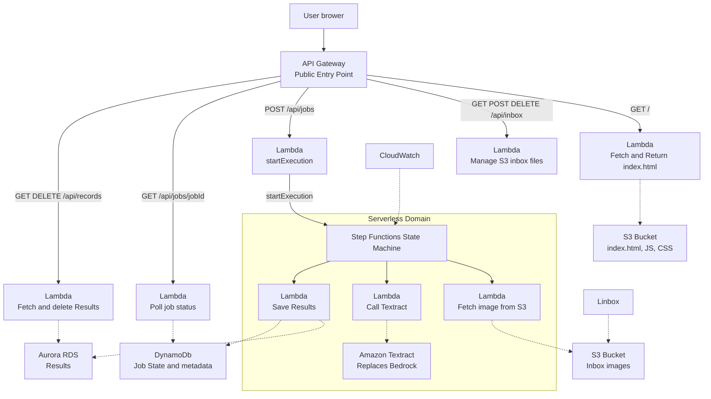

By: 
* Nicolas Fiore
* Cullan Evans

# System Overview
The application is a serverless image processing platform that uses API Gateway as the public entry point. A static website is served from S3 via a Lambda function, while API requests are routed through dedicated Lambda handlers for inbox management, job submission, polling, and result retrieval.

Incoming files are stored in an S3 inbox bucket. A submit Lambda starts a Step Functions workflow, which coordinates three worker Lambdas: L1 fetches the image from S3, L2 calls Amazon Textract for OCR, and L3 saves the results into Aurora and DynamoDB. CloudWatch provides observability for the Step Functions workflow.

## Diagram

# DevOps 

## Gherkin
Nicolas Fiore: 
@import "./image.feature"
Cullan Evans: 
@import "./poll.feature"
# Well Architected Questions
1. Operational Excellence
    Fiore: Monitor with CloudWatch and keep deployment repeatable with SAM.
    Evans:
    
2. Security
    Fiore: Use least-privilege IAM and encrypt data at rest.
    
3. Reliability
    Fiore: Add retries, backups, and alarms for failures.
4. Performance
    Fiore: Use serverless scaling and keep functions small.
    
5. Cost Optimization
    Fiore: Use pay-per-request services and remove unused resources.

# Security, Access, and Recovery
- Apply least-privilege IAM so each Lambda only accesses the S3 bucket, DynamoDB table, or Step Functions execution it needs.
- Encrypt data at rest for S3 and DynamoDB using AWS-managed or customer-managed KMS keys.
- Restrict API Gateway to only allowed routes and methods, and avoid exposing any extra public endpoints.
- Limit Step Functions access so only the submit Lambda and trusted roles can start executions.
- For recovery, enable S3 versioning, use DynamoDB point-in-time recovery, and keep database snapshots for results storage.
- Monitor issues with CloudWatch alarms and use retries or dead-letter queues for Lambda and workflow failures.

# Trusted Advisor

# TCO 
* Estimated Cost: $2.00 A Month

# Template.yaml
@import "./template.yaml"

# Website Picture
